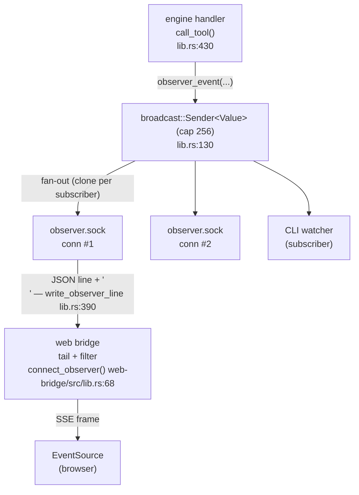

The observer bus is how AgentOS turns every tool call into a live event you can watch from a browser. The [HTTP page](/docs/interfaces/http/) shows the two routes (`/observer/history`, `/observer/stream`); this page is the deep dive — what's behind those routes, why it's shaped the way it is, and how it survives restarts and slow consumers.

## The bus

At the heart of the engine is a single in-process [`tokio::sync::broadcast`](https://docs.rs/tokio/latest/tokio/sync/broadcast/index.html) channel:

```rust
static OBSERVER_EVENTS: Lazy<broadcast::Sender<Value>> = Lazy::new(|| {
    let (tx, _) = broadcast::channel(256);
    tx
});
```

`core/crates/engine/src/lib.rs:130-133`. One sender, many receivers. Anything in the engine can call `observer_events::emit(&event)`; every active subscriber sees a clone.

**Why broadcast and not mpsc?** mpsc is a queue: each item is consumed by exactly one receiver. The observer bus has the opposite shape — N independent consumers that all want the same stream. The CLI's `agentos watch`, the bridge's SSE endpoint, an `mcp-watch` debugger, and a future TUI can all subscribe simultaneously without stealing events from each other. Each `subscribe()` returns a fresh `Receiver` that begins reading from the channel head at the moment of subscription (`lib.rs:135-137`).

## Event lifecycle

A single tool call (graph read, skill run, etc.) emits **at three points**:

| Phase | Site | When |
|---|---|---|
| `started` | `lib.rs:447` | Before dispatch, with `start_body` placeholder ("*Searching...*", "*Loading...*"). |
| `completed` | `lib.rs:533` | On success, with `latency_ms` and the rendered result. |
| `failed` | `lib.rs:547` | On error, with `latency_ms` and the error string. |

Display metadata (`title`, `address`, `icon`, `body_markdown`, `accent_color`) is computed by `observer_display()` (`lib.rs:236-273`) and embedded into every event so consumers don't have to re-derive it. Skill colors are looked up from the skill manifest at emit time.



The observer connection handler (`handle_observer_connection`, `lib.rs:1537`) calls `subscribe()`, optionally drains a history prefix from the graph, then loops `rx.recv()` → `write_observer_line()`.

## Event taxonomy

Every event is a JSON object. Two flavors share the wire — **live** events from `observer_event()` and **history** events from `observer_history_event()` — distinguished by `phase`.

| `phase` | `tool` examples | Notable fields |
|---|---|---|
| `started` | `read`, `search`, `run`, `boot`, `create`, `delete`, `accounts` | `request_id`, `skill?`, `operation`, `arguments`, `display` |
| `completed` | same | adds `latency_ms`, `result` |
| `failed` | same | adds `latency_ms`, `error` |
| `history` | `activity` | replayed past activity from `graph::observer_history`; `display.title` is the activity summary |
| `lagged` | — | broadcast receiver fell behind; `error` carries the skipped count (`lib.rs:1615-1631`) |
| `history_failed` | — | observer history query failed during the prefix replay |

Every event carries `ts`, `session_id`, `client`, `working_dir`, and a `display` block (`title`, `address`, `icon`, `body_markdown`, `accent_color`). See `observer_event()` at `lib.rs:275-306` for the exact schema.

A concrete `completed` payload for a Goodreads skill call:

```json
{
  "ts": "2026-04-14T11:42:08.317",
  "request_id": "req-918",
  "phase": "completed",
  "tool": "run",
  "skill": "goodreads",
  "operation": "get_book",
  "session_id": "claude-code-9f3b",
  "client": "Claude Code",
  "working_dir": "/Users/joe/dev/agentos",
  "arguments": { "skill": "goodreads", "tool": "get_book",
                 "params": { "isbn": "9780140449136" } },
  "display": {
    "title": "goodreads · get_book",
    "address": "9780140449136",
    "icon": "⚡",
    "body_markdown": "## Meditations\n*Marcus Aurelius* · 254 pages",
    "accent_color": "#8a5a44"
  },
  "latency_ms": 412,
  "result": { "isbn13": "9780140449136", "title": "Meditations", "...": "..." },
  "error": null
}
```

## Buffering, ordering, back-pressure

The channel capacity is **256 events** (`lib.rs:131`). Tokio's broadcast is a ring: when the buffer fills and a new event is sent, the oldest event is dropped from the buffer for any receiver still pointing at it. That receiver's next `recv()` returns `RecvError::Lagged(n)` carrying how many events it missed.

The observer connection handler turns that into a synthetic event rather than disconnecting:

```rust
Err(broadcast::error::RecvError::Lagged(skipped)) => {
    let notice = json!({ "phase": "lagged",
                         "error": format!("observer client skipped {} events", skipped),
                         /* ... */ });
    if !write_observer_line(&mut write_half, &notice).await { break; }
}
```

`lib.rs:1615-1631`. The slow consumer keeps its connection but learns it lost N events. Fast events are never blocked by slow consumers — broadcast is lossy by design, which is the right trade for telemetry.

The **bridge** has its own back-pressure story. `connect_observer()` retries up to **20 times** with **250 ms** between attempts (`web-bridge/src/lib.rs:68-83`) — enough to ride out an `agentos restart` (~10 s) while the engine relays its singleton lock and reopens `observer.sock`. After 20 attempts it gives up and the route returns `503 SERVICE_UNAVAILABLE`.

Writes from the engine to a single observer socket are line-buffered JSON: `write_observer_line()` writes the serialized event, a `\n`, and flushes (`lib.rs:390-405`). One event per line, no framing layer needed — `BufReader::read_line` on the bridge side just works.

## Replay semantics

The two routes serve different shapes of the same stream:

- **`/observer/history`** — one-shot. Bridge connects, sends a subscribe line with `history_limit`, reads up to N lines, returns them as a JSON array, closes. No live tail. (`web-bridge/src/lib.rs:124-170`.)
- **`/observer/stream`** — SSE. Bridge subscribes with the same parameters, the engine first drains a history prefix from `graph::observer_history` (newest first, then reversed so the prefix is chronological — `lib.rs:1567-1572`), then switches to live tailing. The bridge yields each engine line as an SSE `data:` frame (`web-bridge/src/lib.rs:205-236`).

`Last-Event-ID` resumption is honored at the SSE protocol level via the prefix replay window. The "ring buffer" is really two layers stacked: the broadcast channel's 256-event tail for in-flight events, and `graph::observer_history` for the durable record persisted in the graph. A reconnecting client gets up to 200 history items (`lib.rs:1558`) and seamlessly resumes live.

`EventSource` reconnects automatically. The engine's `observer.sock` accepts new connections at any time, so a transient close — bridge restart, network blip — heals on its own as long as the engine is alive.

## Why a separate socket

The engine exposes two distinct Unix sockets:

| Socket | Direction | Protocol | Multiplicity |
|---|---|---|---|
| `~/.agentos/engine.sock` | bidirectional | JSON-RPC, request/response | many concurrent clients |
| `~/.agentos/observer.sock` | server → client fan-out | newline-delimited JSON, no responses | many concurrent subscribers |

They could in principle share one socket. They don't, for three reasons:

1. **Framing.** Engine RPC pairs `id` ↔ response; observer is a free-running unidirectional stream. Multiplexing them on one socket means inventing a tag layer, and every consumer becomes a partial demuxer. Separate sockets, separate framing, no demuxer.
2. **Back-pressure.** A slow observer subscriber must not stall RPC writes. With one shared socket, a stuck reader pauses the writer for *both* protocols; with two sockets the kernel's per-socket buffers isolate them.
3. **Trust surface.** Observer is read-only; engine is write-capable. Separate sockets let us tighten observer permissions independently if we ever want unprivileged subscribers (today both are user-private).

Same daemon, same flock — just two listening sockets.

## Failure modes

| Failure | What happens |
|---|---|
| **Engine restart** | `observer.sock` closes. Bridge sees EOF on its `read_line`, the SSE stream ends. Browser `EventSource` reconnects; the bridge re-runs `connect_observer()` with the 20×250 ms retry, picks up the new socket, replays history prefix, resumes live. Total user-visible gap: ~10 s. |
| **Bridge restart** | Engine drops the bridge's broadcast `Receiver` (`Closed`). All `EventSource` connections terminate. Browser auto-reconnects to the new bridge process. |
| **Skill emits faster than the channel drains** | Broadcast ring overruns the slow subscriber. That subscriber gets `RecvError::Lagged(n)`, which the engine surfaces as a synthetic `phase: "lagged"` event over the wire. Fast subscribers are unaffected. The graph's persistent activity log is unaffected — durability lives in the graph, not in the channel. |
| **Bridge can't reach the engine** | After 20 failed connect attempts, `/observer/stream` and `/observer/history` return `503`. `/healthz` reports `engine: false` (`web-bridge/src/lib.rs:99-103`). |
| **Observer socket exists but engine is wedged** | Bridge connects, sends subscribe line, reads zero lines; `read_line` returns `Ok(0)` and the SSE stream closes cleanly. No retry inside a single connection — the browser's `EventSource` will reconnect and try again. |

## Further reading

- [HTTP](/docs/interfaces/http/) — the `/observer/*` route table and SSE contract.
- [Overview](/docs/architecture/overview/) — where the bridge and engine sit in the broader picture.
- [Local-first](/docs/architecture/local-first/) — what the activity log persists and what stays ephemeral.
