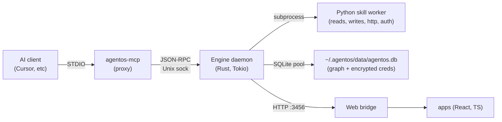

AgentOS is a **Rust engine** that brokers between **Python [skills](/skills/overview/)** (that write to the graph) and **[apps](/apps/overview/)** (that read from it). The engine is the matchmaker: apps ask for capabilities, the engine picks a skill that provides them, and neither side learns the other's name.

The entire system is built from a small number of primitives. Learn these and the rest of the docs fall into place.

## The graph

Three kinds of thing live in SQLite at `~/.agentos/data/agentos.db`:

- **Nodes** — bare identities. A node has an ID and timestamps; nothing else.
- **Edges** — labeled, directional links between two nodes (`tagged_with`, `replied_to`, `parent`).
- **Values** — keyed fields on a node or an edge (`name = "Joe"`, `done = true`).

That's the whole schema. There is no "tasks" table, no "messages" table, no type column on nodes. Semantic types are defined by [shapes](/shapes/overview/) — YAML files loaded into the graph at engine startup. The engine is **shape-aware but entity-agnostic**: it can coerce `priority` (integer) without knowing what "priority" means.

Read more: [Memex & the graph](/shapes/memex-and-graph/) · [Identity & change](/shapes/identity-and-change/)

## The four boundaries

Data moves across four inter-process boundaries. Understanding these is how you reason about security, failure modes, and where code belongs.

### 1. [MCP](/interfaces/mcp/) STDIO → engine socket

AI clients (Cursor, Claude Code, Claude Desktop) speak Model Context Protocol over STDIO to `agentos-mcp`, a thin proxy. The proxy translates MCP calls to JSON-RPC and forwards them over the engine's Unix socket.

### 2. Engine Unix socket (`~/.agentos/engine.sock`)

The engine daemon is a single Rust binary. One engine per machine, enforced by a flock on `~/.agentos/engine.lock`. The socket accepts JSON-RPC from MCP, from the `agentos` [CLI](/interfaces/cli/), and from the web bridge. Everything funnels through here.

### 3. Python subprocess dispatch

Skills are Python. When a skill is called, the engine spawns a fresh Python subprocess, loads the skill module, and runs the SOP. The SDK in the worker (`from agentos import http, secrets, sql`) forwards requests *back* to the engine over a wire protocol — every outbound HTTP call, every credential lookup, every graph write returns to the engine for brokering.

Per-call subprocess, not a long-lived daemon. Clean exit, no shared state between skill runs.

### 4. Web bridge HTTP (`127.0.0.1:3456`)

Optional. For apps that want a browser UI, the web bridge serves `/graph`, `/observer/stream` (SSE), `/user`, and `/shapes` from a read-only SQLite connection. The engine retains write monopoly.

## What runs where



## The capability broker

Skills never name apps. Apps never name skills. They meet through capabilities.

A skill declares what it offers with a decorator:

```python
@provides("llm")
def chat(messages): ...
```

An app asks for a capability by name:

```typescript
await agentos.capability("llm").invoke({ messages })
```

The engine picks the skill. If you install five LLM skills, the engine resolves by user preference and freshness — no hardcoded provider order. If a skill is uninstalled, dependent apps keep working as long as *some* skill provides the capability.

This is the decoupling law. Installing or uninstalling an app has zero impact on skills, and vice versa. The engine is the sole broker.

[Security](/architecture/security/) explains why this matters for trust and auth.

## Where state lives

```
~/.agentos/
  data/agentos.db        The graph + encrypted credentials (one SQLite file)
  logs/                  engine.log, mcp.log, engine-io.jsonl
  engine.sock, mcp.sock  IPC endpoints
  engine.pid, engine.lock  Singleton guards
```

One directory. Portable. Back it up, copy it, nuke it. [Local-first](/architecture/local-first/) explains what is and isn't committed to that directory.
