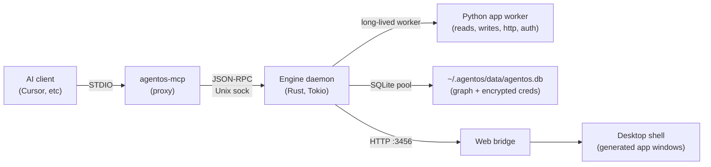

AgentOS is a **Rust engine** that runs **[apps](/apps/overview/)** — Python connectors that bring outside data onto the graph — and renders each of them as a generated window in the desktop shell. The engine is the matchmaker: callers ask for **services**, the engine picks an app that provides them, and neither side learns the other's name.

The entire system is built from a small number of primitives. Learn these and the rest of the docs fall into place.

## The graph

Three kinds of thing live in SQLite at `~/.agentos/data/agentos.db`:

- **Nodes** — bare identities. A node has an ID and timestamps; nothing else.
- **Links** — labeled, directional links between two nodes (`tagged_with`, `replied_to`, `parent`).
- **Values** — keyed fields on a node or an link (`name = "Joe"`, `done = true`).

That's the whole schema. There is no "tasks" table, no "messages" table, no type column on nodes. Semantic types are defined by [shapes](/shapes/overview/) — YAML files loaded into the graph at engine startup. The engine is **shape-aware but entity-agnostic**: it can coerce `priority` (integer) without knowing what "priority" means.

Read more: [Memex & the graph](/shapes/memex-and-graph/) · [Identity & change](/shapes/identity-and-change/)

## The four boundaries

Data moves across four inter-process boundaries. Understanding these is how you reason about security, failure modes, and where code belongs.

### 1. [MCP](/interfaces/mcp/) STDIO → engine socket

AI clients (Cursor, Claude Code, Claude Desktop) speak Model Context Protocol over STDIO to `agentos-mcp`, a thin proxy. The proxy translates MCP calls to JSON-RPC and forwards them over the engine's Unix socket.

### 2. Engine Unix socket (`~/.agentos/engine.sock`)

The engine daemon is a single Rust binary. One engine per machine, enforced by a flock on `~/.agentos/engine.lock`. The socket accepts JSON-RPC from MCP, from the `agentos` [CLI](/interfaces/cli/), and from the web bridge. Everything funnels through here.

### 3. Python worker dispatch

Apps are Python. The engine holds one long-lived async Python worker; app tool calls multiplex onto its asyncio event loop. The SDK in the worker (`from agentos import http, secrets, sql`) forwards requests *back* to the engine over a wire protocol — every outbound HTTP call, every credential lookup, every graph write returns to the engine for brokering. See [App dispatch](/architecture/app-dispatch/) for the close-up.

### 4. Web bridge HTTP (`127.0.0.1:3456`)

The web bridge serves the desktop shell — `/graph`, `/observer/stream` (SSE), `/user`, and `/shapes` — from a read-only SQLite connection. The engine retains write monopoly. Every installed app renders in the shell as a **generated window** (`core/web/src/views/AppWindow.tsx`), built from the app's contract: its `@returns` shapes and JSON-Schema input schemas. There is no hand-written per-app UI.

## What runs where



## The service broker

Apps never name each other. Callers never name apps. They meet through services.

An app declares what it offers with a decorator:

```python
@provides(web_search)
def search(query: str, **params): ...
```

A caller — an agent over MCP, or another app through the SDK — asks for the service by name (`services.web_search`, or `await llm.chat(...)` in Python). The engine picks the app: the user's default app for that service first (the `defaults_to` edge), then by preference and freshness — no hardcoded provider order. If an app is uninstalled, callers keep working as long as *some* app provides the service.

This is the decoupling law. Apps never import each other; the engine is the sole broker.

### Two kinds of apps: installed and system

Most apps are **installed** — Python modules under `apps/<category>/<name>/`, sandboxed, user-space, installable and removable. They're how AgentOS integrates with external platforms (Gmail, 1Password, Linear, ABP).

A smaller set are **system apps** — engine-native `@provides(X)` implementations compiled into the Rust binary under `crates/system-apps/`. They participate in matchmaking identically to installed apps (same `services.list_providers` / brokered `services.*` path, same `@provides` walk) but the tool body runs in Rust and the code can't be forked or modified by app authors. System apps exist for **system-level primitives**: vault access, URL parsing, hashing, DNS, things that should be present on any engine and that benefit from being co-located with the key material or syscalls they touch.

The first system app is `vault` — `@provides(login_credentials)` over the local encrypted credential vault. When an app calls `credentials.retrieve(domain, required=[...])`, the matchmaker tries vault first (local, ~ms, no prompt), then falls through to installed providers (1Password, macOS Keychain) on a miss. External providers' successful matches write back to the vault, so the next call is served locally.

[Security](/architecture/security/) explains why this matters for trust and auth.

## Where state lives

```
~/.agentos/
  data/agentos.db        The graph + encrypted credentials (one SQLite file)
  logs/                  engine.log, mcp.log, engine-io.jsonl
  engine.sock, mcp.sock  IPC endpoints
  engine.pid, engine.lock  Singleton guards
```

One directory. Portable. Back it up, copy it, nuke it. [Local-first](/architecture/local-first/) explains what is and isn't committed to that directory.
