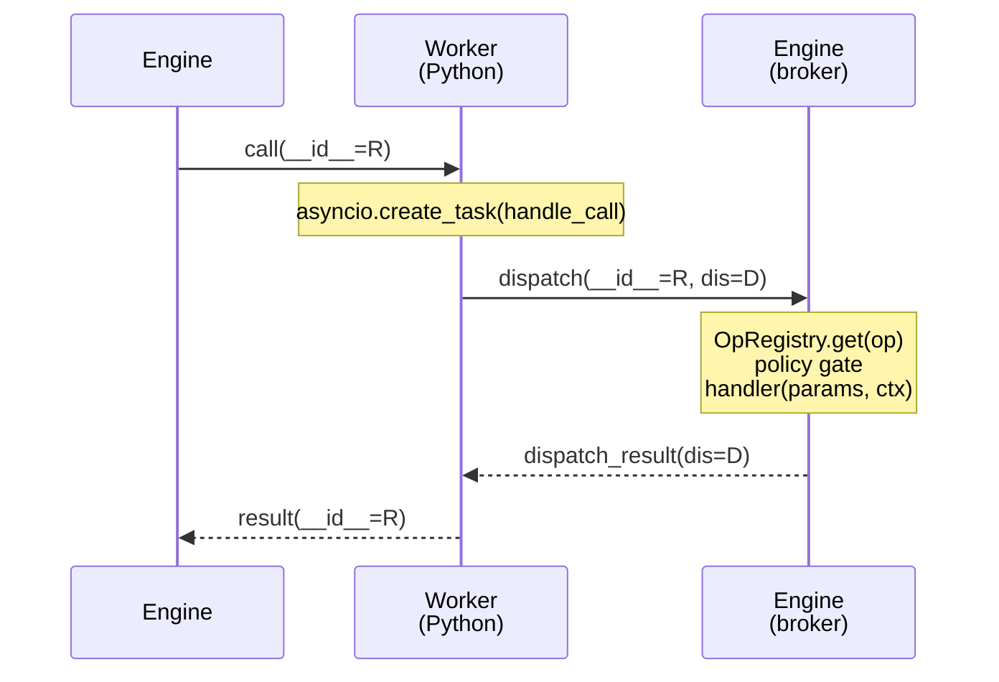

A skill call is one of the busier paths in AgentOS. The engine receives a tool invocation, hands it to a long-lived Python worker over JSON-line stdio, and then services every side-effect the skill triggers — HTTP, secrets, SQL, LLM — by routing requests back across the same pipe. This page is the close-up of that exchange.

For framing — the four boundaries, the capability broker, where state lives — see the [architecture overview](/architecture/overview/). This page assumes it.

## The shape of a call

One Python process per machine, not per call. The async worker is spawned lazily on the first dispatch and held behind a global `OnceLock<TokioMutex<Option<Arc<AsyncPythonWorker>>>>` (`crates/kernel/src/python_worker.rs:53`). All subsequent calls multiplex onto its asyncio event loop. Each operation runs as an asyncio task; multiple calls — and multiple sideband dispatches inside each call — are in flight concurrently on a single Python interpreter.



Three messages on the wire (`call`, `dispatch`, `dispatch_result`, plus the terminal `result`), two correlation IDs. That's the whole protocol.

## Wire format

JSON, one object per line, on the worker's stdin and stdout. Three message kinds:

| Direction      | `__type__`         | Routing key             | Purpose                                   |
|----------------|--------------------|-------------------------|-------------------------------------------|
| Rust → Python  | `call`             | `__id__`                | Start an operation                        |
| Python → Rust  | `dispatch`         | `__id__`, `__dispatch_id__` | Sideband call back to the engine      |
| Rust → Python  | `dispatch_result`  | `__dispatch_id__`       | Reply to one dispatch                     |
| Python → Rust  | `result`           | `__id__`                | Final return for an operation             |

A `call` envelope (`crates/kernel/src/python_worker.rs:724`):

```json
{ "__type__": "call",
  "__id__": "8c2f…-uuid",
  "__call__": {
    "module": "/path/to/skill.py",
    "function": "search",
    "kwargs": { "q": "memex" },
    "working_dir": "/path/to/skill",
    "capabilities": ["http", "secrets"],
    "env": { "timezone": "America/New_York", "locale": "en_US.UTF-8" }
  } }
```

A sideband `dispatch` (`crates/kernel/src/python_worker.rs:171`):

```json
{ "__type__": "dispatch",
  "__id__": "8c2f…-uuid",
  "__dispatch_id__": "d-7",
  "__caps__": ["http", "secrets"],
  "__dispatch__": { "op": "client.get", "params": { "url": "…" } } }
```

The engine answers with `{"__type__": "dispatch_result", "__dispatch_id__": "d-7", "payload": …}` — or `__error__` on failure. Both arms always stamp `__type__` and `__dispatch_id__` so the worker's correlation map can resolve the future regardless (`crates/kernel/src/python_worker.rs:639`).

The terminal `result` is whatever the Python function returned, plus `__type__: "result"` and `__id__`. Bare scalars or lists get wrapped as `{"value": …}` so protocol fields can ride alongside; the Rust side unwraps before returning to the caller (`crates/kernel/src/python_worker.rs:770`).

## Request correlation

The worker holds two maps, both behind `tokio::sync::Mutex` (`crates/kernel/src/python_worker.rs:84`):

- **`pending_results: HashMap<String, oneshot::Sender<Value>>`** — keyed by request `__id__`. Populated by `dispatch_async` before writing the `call`; drained by the `response_reader` task when a `result` arrives.
- **`call_origins: HashMap<String, (String, String)>`** — keyed by request `__id__`, holds `(module, function)`. Used by the response reader to stamp `trigger = "skill_id:tool"` onto every sideband `DispatchCtx` so the audit log knows which tool issued the side-effect.

On the Python side, `_pending_dispatches: dict[str, asyncio.Future]` does the same job for `dispatch_id`s (`crates/kernel/src/python_worker.rs:150`). Each `_dispatch_to_engine` mints a fresh `d-N` (monotonic counter), parks an `asyncio.Future` in the dict, writes the `dispatch`, and `await`s the future under an 1800-second `wait_for`.

This matters as soon as a skill makes concurrent calls. `await asyncio.gather(client.get(a), client.get(b), secrets.get("k"))` produces three `dispatch` lines on stdout in arbitrary order, three `tokio::spawn`ed handler tasks on the engine side, and three `dispatch_result` lines back in arbitrary order. Each side resolves them by `__dispatch_id__`. There is no global ordering — the protocol is fully demuxed.

## Context variables

The trick that holds it all together is `contextvars.ContextVar`. When the worker reads a `call`, it spawns the operation as `asyncio.create_task(handle_call(msg))` and inside that task it sets two context vars before running the user code (`crates/kernel/src/python_worker.rs:269`):

```python
_current_request_id.set(request_id)
_current_caps.set(list(call_info.get("capabilities") or []))
```

`ContextVar` semantics in asyncio mean every task spawned by the skill inherits a snapshot. So when a skill does `asyncio.gather(...)`, each child task sees the same `__id__` and the same capability list — and `_dispatch_to_engine` reads them on every outbound message. No thread-locals, no explicit plumbing through every SDK call.

`__caps__` is the load-bearing one for security. The engine's policy gate (`crates/kernel/src/python_worker.rs:457`) intersects the worker-stamped caps with `OpMeta::required_capabilities`. An empty list — the default — means the gate rejects any op that declares a requirement. Skills declare their capabilities in YAML frontmatter; the worker echoes them back on every dispatch; the engine enforces them. The skill subprocess can lie about anything except the data the engine itself stamped into the `call` envelope.

## Sideband dispatch

A skill never calls `urllib`, `sqlite3`, or `keyring`. The worker installs a sandboxed `__import__` that raises on those, plus a few siblings (`subprocess`, `httpx`, `requests`, `urllib3`, `socket`, `ctypes`, `multiprocessing`, `signal` — `crates/kernel/src/python_worker.rs:204`). All I/O goes through SDK modules whose implementations are thin wrappers around `_dispatch_to_engine`.

The dispatchable surface is one `OpRegistry` lookup away. Op metas live in `crates/ops/src/` — one module per topic — and are flattened by `all_op_metas()` (`crates/ops/src/lib.rs:574`):

| Topic       | Examples                                  | Why through the engine                                         |
|-------------|-------------------------------------------|----------------------------------------------------------------|
| `http.*`    | `client.get`, `client.post`, `client.delete` | Auth resolution + cookie writeback + audit log                 |
| `secrets.*` | `secrets.read`, `secrets.write`           | Encryption key lives in process memory; never shipped to skill |
| `sql.*`     | `sql.query`                               | DB path resolution, capability gate, read-only enforcement     |
| `llm.*`     | `llm.chat`, `llm.resolve_tools`           | Capability brokering — picks an `@provides("llm")` skill       |
| `shell.*`   | `shell.run`                               | Capability gate (`"shell"`); audit log                         |
| `crypto.*`  | (hash/sign helpers)                       | Stable, audited surface                                        |
| `plist.*`   | macOS plist read                          | Same                                                           |
| `progress.*`| `progress.report`                         | Fire-and-forget — no ack on the wire                           |

Every dispatch flows through `dispatch_through_registry` (`crates/kernel/src/python_worker.rs:439`). The handler runs on a `tokio::spawn`ed task, writes an audit line via `Env::record_io_line` to `~/.agentos/logs/engine-io.jsonl`, and returns a `dispatch_result`. The seam between worker and handler is entirely `agentos-ops` protocol types, so the same worker binary serves both the engine (graph-backed `Env`) and the standalone `agentos-exec` binary (secrets-only `Env`).

The whole point: every side-effect is observable, gateable, and auth-brokered at one place. The skill is just a coroutine that produces JSON.

## Failure modes

| Failure                                | What happens                                                                                                                          |
|----------------------------------------|---------------------------------------------------------------------------------------------------------------------------------------|
| Worker process crashes mid-call        | The `response_reader` loop exits its `while let Ok(Some(line))`, drains `pending_results`, and sends `{"__error__": "Worker process exited"}` to every parked oneshot (`crates/kernel/src/python_worker.rs:662`). On the next `dispatch_async`, `ensure_async_worker` notices `_reader_handle.is_finished()` and respawns. |
| Operation times out                    | `dispatch_async` removes the pending entry + origin, nulls the global worker slot to force a respawn, and returns `WorkerError::Timeout` (`crates/kernel/src/python_worker.rs:786`). The next call gets a fresh interpreter — currently the only way to clear leaked task state. |
| Sideband dispatch never returns        | The Python side has its own ceiling: `asyncio.wait_for(future, timeout=1800)` raises `TimeoutError`, which the SDK surface translates into a Python exception inside the skill (`crates/kernel/src/python_worker.rs:180`). The worker stays up. |
| Engine handler panics                  | Caught at the `tokio::spawn` boundary; the dispatch never gets a `dispatch_result`. The Python side hits its 1800s ceiling. Today this is the same path as a hung dispatch — distinguishing them would need a per-handler error envelope, which isn't shipped. |
| Skill function isn't `async def`       | The worker raises before invoking it (`crates/kernel/src/python_worker.rs:240`) — sync skills would receive coroutine objects instead of awaited results from `client.get()` and friends. All skills must be `async def`. |
| Engine restart while worker is alive   | On Linux the worker is bound to the engine via `prctl(PR_SET_PDEATHSIG, SIGTERM)` and dies with it (`crates/kernel/src/python_worker.rs:373`). On macOS there's no equivalent; orphaned workers exit when their stdin closes. |

## Why this shape

It's one more boundary than strictly necessary. A skill could in principle just open an HTTP socket. Instead it asks the engine, which asks the vault, which asks the OS keychain, which returns bytes that get reattached as a request header that gets logged and then sent. Five hops to fetch one URL.

The trade is engine-enforced brokering on every side-effect: the auth-resolution policy from [Security](/architecture/security/) runs *every time*, not just at "configure." Capability gates are cheap to reason about because they're checked at a single seam. The audit log is complete by construction — if it isn't in `engine-io.jsonl`, it didn't happen. And the same worker binary serves both the engine and `agentos-exec` because the seam is protocol, not implementation.

The skill is reduced to a pure-ish function from JSON to JSON. That's the thing that makes the rest of the system tractable.
