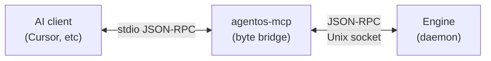

**Model Context Protocol** is how AI clients talk to AgentOS. When Claude Desktop, Cursor, or Claude Code starts a session, it spawns `agentos-mcp`, a thin stdio proxy. Everything you do in the AI client — searching, reading, writing to the graph — is an MCP tool call that flows through this proxy into the engine.

## Wire model



- **Client → proxy** — newline-delimited JSON-RPC over stdin/stdout. Standard MCP.
- **Proxy → engine** — the proxy opens `~/.agentos/engine.sock` and forwards bytes. It does not parse MCP messages; it's a byte bridge with bookkeeping.
- **Engine is where logic lives** — tool dispatch, skill execution, graph reads and writes.

The proxy is tiny on purpose. If MCP evolves, the proxy is the only piece that has to change. Skills and the engine don't know MCP exists.

## Bootstrap and resilience

When the AI client starts, the proxy:

1. Calls `ensure_engine()` — if no engine daemon is running, it starts one (using the same `agentos` binary).
2. Connects to `~/.agentos/engine.sock`.
3. Saves the client's `initialize` request and the `notifications/initialized` follow-up.
4. Starts forwarding bytes.

If the engine socket dies mid-session, the proxy reconnects with jittered exponential backoff and replays the saved handshake. The AI client sees a brief pause, not a hard error.

All wire traffic is mirrored to `~/.agentos/logs/mcp.log` with timestamps and `→`/`←` direction markers. If something's broken, that log is where to look.

## Installing into an AI client

Each client has its own config. Three we've tested:

### Claude Desktop

Edit `~/Library/Application Support/Claude/claude_desktop_config.json`:

```json
{
  "mcpServers": {
    "agentos": {
      "command": "agentos",
      "args": ["mcp"]
    }
  }
}
```

Restart Claude Desktop. The AgentOS tools will appear in the tool drawer.

### Cursor

Cursor reads MCP config from its settings. Add:

```json
{
  "mcp.servers": {
    "agentos": {
      "command": "agentos",
      "args": ["mcp"]
    }
  }
}
```

### Claude Code (CLI)

```bash
claude mcp add agentos -- agentos mcp
```

## The capability surface

What an AI client actually gets through MCP is a set of tools. The engine registers them dynamically based on which skills are installed. Think of it as an extensible tool drawer — install a new skill, its operations become MCP tools on the next connection.

The tool names, parameter schemas, and return shapes are all generated from the skill's `@sop` and `@returns` decorators. Shape-conformant return dicts become shape-conformant JSON; the AI client sees typed tools with no AgentOS-specific glue.

## Failure modes

- **Engine won't start** — check `~/.agentos/logs/engine.log`. Usually a port conflict (if the web bridge is also starting) or a corrupt SQLite file.
- **Proxy connects but tools don't show up** — the client probably needs a restart. MCP `tools/list` is cached on the client side.
- **Intermittent timeouts on a specific tool** — the skill's SOP is slow. Check `~/.agentos/logs/engine-io.jsonl` for the request, then test the skill directly with `agentos test-skill`.

## Design notes

- **The proxy is stateless.** It doesn't track tool call IDs, doesn't cache responses, doesn't have its own auth. Every piece of logic lives in the engine.
- **MCP is a transport choice, not a contract.** The engine exposes the same tools over the CLI's `agentos call` and the HTTP bridge's `/graph`. MCP is just one way to reach them.
- **No remote MCP.** `agentos-mcp` is strictly local — stdio + Unix socket. If you want remote agent access, that's a different architecture (and not shipping).
