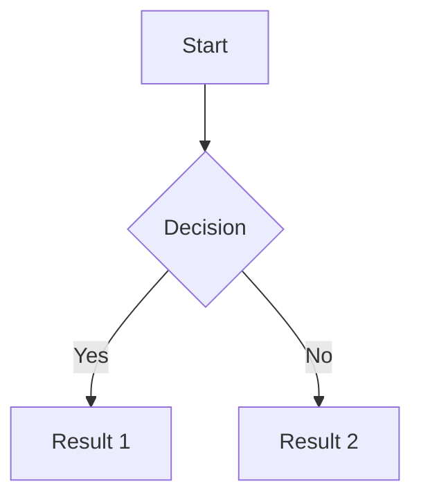

## What "Best-in-Class" Markdown Support Includes Today

### Core Foundation: CommonMark + GFM

- CommonMark provides the unambiguous base specification (current version 0.31.2)
- GitHub Flavored Markdown (GFM) is the de facto extended standard, adding:
  - Tables with alignment support
  - Task lists (checkboxes)
  - Strikethrough (`~~text~~`)
  - Autolinks (URLs, mentions, issues)
  - Fenced code blocks with syntax highlighting

### Rich Content Features

| Feature | Syntax | Adoption Level |
|---------|--------|----------------|
| Mermaid diagrams | ` ```mermaid ` code fence | High (GitHub, GitLab, major editors) |
| Math expressions | `$inline$` and `$$block$$` | High (KaTeX/MathJax) |
| Alerts/Callouts | `> [!NOTE]`, `> [!WARNING]` etc. | Growing (GitHub standard) |
| Collapsed sections | `<details>` HTML | Universal |
| Syntax highlighting | Language identifier in code fence | Universal |

---

## Table Stakes vs Differentiators

### Table Stakes (expected everywhere)

- CommonMark/GFM compatibility
- Syntax highlighting (50+ languages)
- Tables with alignment
- Task lists (checkboxes)
- Autolinks and auto-references
- Basic math (`$...$` and `$$...$$`)
- Live preview (split-pane at minimum)
- Image embedding
- Fenced code blocks

### Differentiators (competitive advantages)

- **Native Mermaid rendering** without plugins
- **Rich callouts/admonitions** with icons and styling
- **WYSIWYG/live rendering** (Typora-style inline preview)
- **MDX support** for interactive components
- **Bi-directional links** (Obsidian-style `[[wikilinks]]`)
- **AI-assisted writing** integrated into editor
- **Multi-format export** (PDF, DOCX, LaTeX)
- **Collaborative editing** with real-time sync
- **Transclusion** (embed content from other files)
- **Custom blocks via plugins/extensions**

---

## Mermaid Diagram Adoption and Usage Patterns

### Adoption Timeline

- February 2022: GitHub rolled out native Mermaid support
- Now supported: GitHub, GitLab, Azure DevOps, Notion, Obsidian, VS Code, and most modern markdown tools

### Supported Diagram Types

- Flowcharts (most common)
- Sequence diagrams
- Class diagrams
- Entity relationship diagrams
- Gantt charts
- Git graphs
- User journey diagrams
- State diagrams
- Pie charts

### Usage Pattern

```markdown

```

### Implementation Approach (GitHub)

GitHub uses a two-stage rendering process: an HTML pipeline identifies `mermaid` code blocks, then an iframe with their Viewscreen service renders diagrams asynchronously. This isolates user content and reduces JavaScript payload.

### Progressive Enhancement

Clients without JavaScript see the original markdown code, ensuring content remains accessible.

---

## Rich Content Support

### Math (KaTeX vs MathJax)

| Library | Pros | Cons |
|---------|------|------|
| **KaTeX** | Fastest rendering, no reflow, self-contained | Smaller feature set |
| **MathJax** | Most complete LaTeX support, accessibility features | Heavier, slower |

Syntax is standardized:
- Inline: `$E = mc^2$` or `\(E = mc^2\)`
- Block: `$$\int_0^\infty e^{-x^2} dx$$` or `\[...\]`

### Callouts/Admonitions (fragmented landscape)

| Platform | Syntax |
|----------|--------|
| **GitHub** | `> [!NOTE]`, `> [!TIP]`, `> [!WARNING]`, `> [!IMPORTANT]`, `> [!CAUTION]` |
| **MyST** | `:::{note}`, `:::{tip}`, `:::{warning}` with directive syntax |
| **MkDocs Material** | `!!! note "Title"` with indented content |
| **Obsidian** | `> [!info]`, `> [!warning]` (similar to GitHub) |

GitHub's syntax is gaining adoption as the emerging standard due to GitHub's influence. It builds on blockquote syntax which degrades gracefully.

### Embeds

- Images: Standard `` with optional sizing
- Videos: Platform-specific or HTML `<video>` tags
- iframes: Generally require HTML or MDX
- Foreign media: No standardized markdown syntax yet

---

## MDX vs Markdown

| Aspect | Markdown | MDX |
|--------|----------|-----|
| **Learning curve** | Very low | Medium-high (requires React/JSX) |
| **Interactivity** | Static only | Full React components |
| **Performance** | Fast, no overhead | Slightly heavier (React bundle) |
| **Collaboration** | Easy for non-developers | Technical writers need JSX knowledge |
| **Use cases** | Docs, READMEs, blogs, notes | Interactive tutorials, component docs |
| **Framework support** | Universal | Next.js, Gatsby, Remix (React ecosystem) |

### When to use MDX

- Interactive code playgrounds
- Embedded data visualizations
- Component documentation with live examples
- Dynamic content based on state

### When to stick with Markdown

- Simple documentation
- README files
- Blog content
- Notes and wikis
- Cross-platform compatibility

---

## Live Preview and Editing Approaches

### 1. Split-Pane (Traditional)

- Editor on left, rendered preview on right
- Examples: VS Code, many web editors
- Pros: Full control over raw markdown, familiar
- Cons: Context switching, screen real estate

### 2. WYSIWYG / "What You See Is What You Mean"

- Renders markdown inline as you type
- Example: Typora (renders in place)
- Pros: Intuitive, focused writing experience
- Cons: Harder to see/edit raw syntax

### 3. Hybrid/Block-Based

- Blocks render but allow raw editing on focus
- Examples: Notion-style editors, Obsidian (partially)
- Pros: Best of both worlds
- Cons: More complex interaction model

### Modern Trends

- AI-assisted writing integration (ShyEditor, others)
- Real-time collaboration (Google Docs-style)
- Minimal/distraction-free modes
- Mobile-first responsive editing

---

## CommonMark Extensions Landscape

### Deployed Extensions (widely implemented)

- Tables (GFM)
- Task lists (GFM)
- Strikethrough (GFM)
- Autolinks (GFM)
- Footnotes
- Definition lists
- Abbreviations
- Superscript/subscript

### Proposed Extensions (under discussion)

- Attributes (generic `{#id .class}` syntax)
- Admonitions/callouts
- Custom containers
- Smart links
- Figure captions
- Transclusion

### Key Insight

The CommonMark spec deliberately stays minimal, with extensions handled by individual implementations. GFM has become the practical extended standard.

---

## Key Takeaways for Implementation

1. **Start with GFM compatibility** - it's the baseline expectation
2. **Add Mermaid support** - increasingly expected, especially for technical docs
3. **Support GitHub-style alerts** - emerging as the admonition standard
4. **Include math rendering** - KaTeX for speed, MathJax for completeness
5. **Provide flexible preview** - at minimum split-pane, ideally hybrid
6. **Consider MDX** - but only if your audience is technical and React-familiar
7. **Export options matter** - PDF, HTML, and ideally DOCX
8. **AI integration** - becoming a differentiator in 2025
